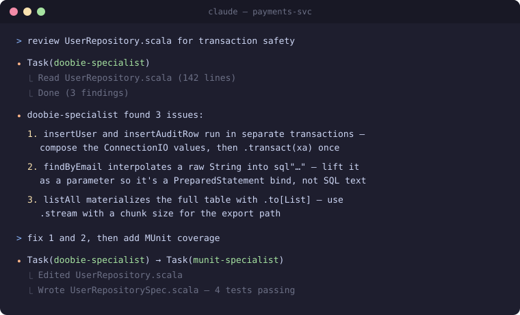

# Scala Teams Claude Code plugin

[](https://github.com/scalateams/scalateams-claude-plugin/actions/workflows/validate.yml)

Specialist agents for the Scala ecosystem, designed for use with [Claude Code](https://claude.com/claude-code).

One agent per library or concern. No bloat.



## Install

```bash
claude plugin marketplace add https://github.com/scalateams/scalateams-claude-plugin
claude plugin install scalateams@scalateams
```

Or from a local clone:

```bash
claude plugin marketplace add /path/to/scalateams-claude-plugin
claude plugin install scalateams@scalateams
```

## What you get

Specialist agents covering:

- **Build:** sbt, Mill
- **Effect systems:** Pekko (actor, streams, persistence, HTTP, Kafka), ZIO (core, streams, HTTP, Kafka), Cats Effect (core, fs2, http4s, fs2-kafka)
- **Testing:** ScalaTest, MUnit, Weaver, zio-test
- **API design:** Tapir
- **Codecs:** Circe, jsoniter-scala, Play JSON
- **Protocols:** ScalaPB (gRPC + protobuf), avro4s
- **Databases:** Doobie, Quill, Slick
- **FP review:** separate Scala 2 and Scala 3 reviewers (the idiom catalogs differ enough to warrant the split)

See [`docs/usage.md`](./docs/usage.md) for the full agent catalog, triggers, and composition patterns. See [`CLAUDE.md`](./CLAUDE.md) for design rationale.

## Usage examples

Claude Code routes to specialists automatically based on what you ask — you rarely need to name an agent. The library you mention is the routing signal:

```text
> review this Doobie query for transaction safety
  → doobie-specialist

> is this Scala 3 ADT idiomatic?
  → scala3-fp-reviewer

> add a streaming endpoint in zio-http
  → zio-http-specialist
```

Tasks that cross library boundaries engage specialists in sequence:

```text
> wire up a Tapir endpoint with Circe codecs on http4s
  → tapir-specialist → circe-specialist → http4s-specialist

> consume Avro messages from Kafka in this Pekko service
  → pekko-kafka-specialist → avro4s-specialist
```

You can also force a specific agent by name, or start with the explorer on an unfamiliar repo:

```text
> use the quill-specialist to review this dynamic query

> scope this task — which specialists should we use?
  → codebase-explorer (detects framework, Scala version, build tool)
```

More patterns, triggers, and the full catalog: [`docs/usage.md`](./docs/usage.md).

## Philosophy

Specialists are **narrow on purpose**. Reviewing a Doobie query and a Slick query draw on different libraries with different ergonomics — bundling them into one "DB reviewer" forces every invocation to carry context for libraries it isn't using. We picked sharper over broader.

When a task crosses libraries, the main agent invokes multiple specialists in sequence. That's the intended pattern, not a workaround.

## Contributing

PRs welcome. Add a specialist by:

1. Creating `agents/<name>-specialist.md`
2. Keeping the agent body under ~150 lines
3. Listing it in `CLAUDE.md`

## Privacy

The plugin collects nothing — no telemetry, no analytics, no network calls of its own. See [PRIVACY.md](./PRIVACY.md).

## License

MIT
